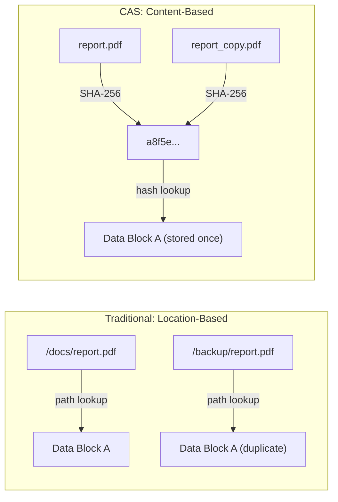
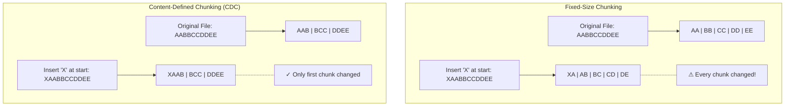
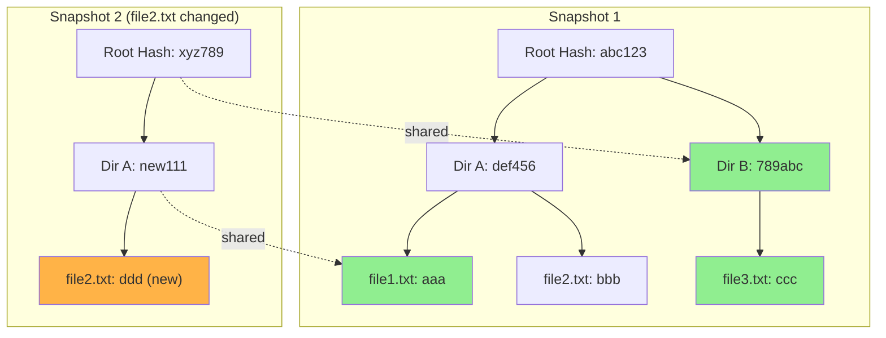

If you have ever tried to back up a terabyte of data to the cloud, you know the naive approach of copying everything every time is a disaster. It is slow, expensive, and kills your bandwidth. To solve this, the industry moved to incremental backups where only changed data is uploaded. However, as data scales into the petabytes, the standard way of doing incrementals is hitting a wall.

In this article, we look at the state of the art techniques used by modern storage engines and why the next generation of backup tech is moving toward a more flexible, flat architecture.

## 1. Content Addressable Storage (CAS)

The biggest leap in modern backup architecture is abandoning files and folders at the storage layer. Instead, industry leaders use **Content Addressable Storage (CAS)**. In a traditional system, data is found by its path. In CAS, data is found by its cryptographic hash such as SHA-256.

The CAS logic is simple. Same content leads to the same hash which is stored once. This is the foundation of **deduplication**. If you rename a file or move it to a different folder, a CAS based system realizes the content has not changed and uploads exactly zero bytes.

### The Confirmation Attack

Standard CAS has a privacy hole. If a cloud provider knows the hash of a specific file, they can see if your bucket contains that hash even if they cannot read the encrypted content.

To solve this, one solution is to avoid using raw hashes for chunk names. Instead, we can use **Keyed HMAC-SHA256**. By using a secret key known only to you to salt the hashes, your data remains fully deduplicated but becomes cryptographically opaque to the host.

### The Boundary Shift Problem

What if you have a 10GB database and change one single row?

Slicing it at fixed 1MB intervals is a trap. If you insert one byte at the very beginning, every 1MB boundary shifts. This changes the hash of every block.

### The Solution: Content Defined Chunking (CDC)

Modern systems use algorithms like **FastCDC**. It rolls a sliding window across the data. When the data matches a specific mathematical pattern, it slices the chunk.

Because the boundaries are determined by the content itself, an insertion at the start only changes the first chunk. The rest of the puzzle pieces realign perfectly.

## 2. Structural Sharing: The Magic of Merkle Trees

Once you have thousands of content addressed chunks, you must remember which chunks belong to which files at a specific point in time. The industry standard is the **Merkle Tree**. This is a hierarchical structure where every node is the hash of its children. This enables **Structural Sharing**.

When you take a new backup:

- You only upload the **modified chunks**.
- A new root hash is generated for the snapshot.
- Most of the tree simply **points to the previous snapshot's nodes**.

The result is that every snapshot acts like a full backup for recovery, but it only consumes the storage space of an incremental update.

## 3. The Directory Tree Trap

Most modern tools build their Merkle Trees by mirroring the computer's natural directory structure. While intuitive, this path based approach creates two major headaches at scale.

**Path Amplification:** If you have a file buried ten folders deep, changing that one file forces the system to recalculate and reupload metadata for all ten parent directories.

**The Rigid Hierarchy Problem:** Modern data does not always live in a neat tree. Cloud drives like Google Drive allow a single file to have multiple parents, and flat data streams like database dumps do not have folders at all. Standard tools struggle to map these non tree structures efficiently, which often leads to metadata bloat.

## 4. About the Author

I have been looking into these industry standards while building [Cloudstic](https://github.com/Cloudstic), a project aimed at solving these specific bottlenecks. To achieve both zero trust privacy and high performance, I realized the engine needed to be built from the ground up.

Cloudstic is a content addressable, encrypted CLI backup tool designed to be fully stateless. Unlike many traditional tools, it can back up from Google Drive and OneDrive using incremental APIs without ever needing to mount the drive.

**Core Features:**

- **Encrypted by Default:** Uses AES-256-GCM encryption with password, platform key, or recovery key slots.
- **Content Addressable:** Native deduplication across all sources; identical files are stored only once.
- **Versatile Backends:** Supports local filesystems, Amazon S3 (R2, MinIO), and Backblaze B2.
- **Smart Retention:** Automated keep-last, hourly, daily, and yearly retention policies.
- **Point-in-Time Restore:** Instant access to any snapshot or file from any point in history.
