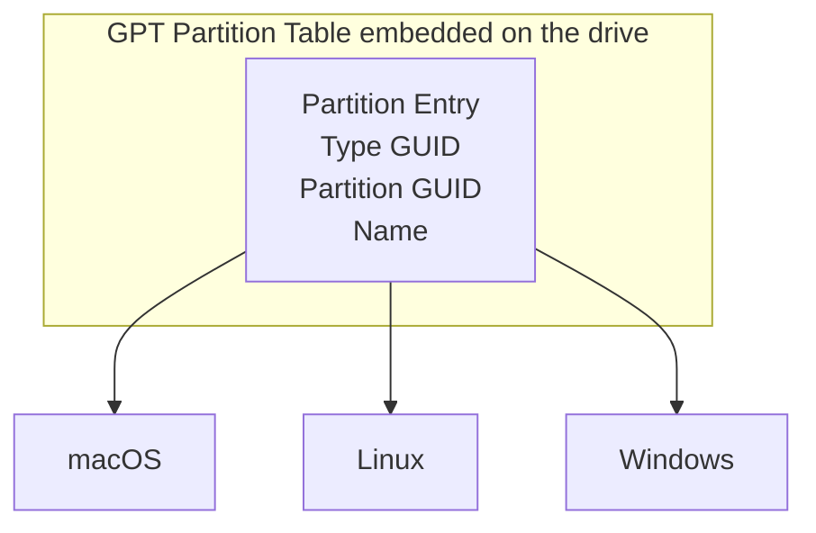

A portable drive is convenient storage. It is not a backup.

External SSDs and USB drives travel between machines. One day your drive is connected to your Mac, the next day to a Linux workstation, and later to a Windows laptop. That mobility is exactly what makes backing them up surprisingly difficult.

Most backup tools quietly assume that the *machine and mount path* define the identity of the source being backed up. Portable drives break that assumption.

On Monday your SSD appears at `/Volumes/WorkDrive` on macOS.  
On Tuesday the same drive mounts at `/media/alice/WorkDrive` on Linux.  
On Wednesday it becomes `E:\` on Windows.

To a human these are obviously the same drive. To most backup tools they look like completely different sources.

The result is frustrating. Instead of uploading only the files that changed, the tool must rescan the entire drive and rebuild snapshot metadata. Incremental history becomes fragmented and backups take longer than necessary.

This article explores how popular backup tools behave in this situation. Then we show how using the **GPT partition UUID** solves the cross-machine identity problem and enables proper incremental backups with Cloudstic CLI.

## The Cross-Machine Problem

Suppose you have a 100 GB portable SSD and you want encrypted incremental backups to a cloud bucket.

Day 1: you plug the drive into your Mac and run a backup.  
Day 2: you plug the same drive into a Linux workstation.

You changed only **200 MB** of files.

How much data should the second backup upload?

With a tool that treats both runs as the **same source**: **200 MB**.

With a tool that treats them as **different sources**: the entire drive must be scanned again and a new snapshot tree created. Even when chunk deduplication prevents re-uploading most data blocks, the backup still requires hashing every file and storing new metadata.

```mermaid
graph LR
    Drive["🔌 Portable SSD\n100 GB"]

    Drive -->|Day 1 - macOS| MA["/Volumes/WorkDrive"]
    Drive -->|Day 2 - Linux| LX["/media/alice/WorkDrive"]
    Drive -->|Day 3 - Windows| WN["E:\\"]

    MA -->|hostname+path based identity| S1["Snapshot 1\n100 GB uploaded"]
    LX -->|different host+path, no match| S2["Snapshot 2\nnew snapshot tree"]
    WN -->|different host+path, no match| S3["Snapshot 3\nnew snapshot tree"]
````

The correct behaviour requires a stable identifier for the drive that survives remounting. That identifier already exists on every modern drive: the **GPT partition UUID**.

```mermaid
graph LR
    Drive["🔌 Portable SSD\nGPT UUID: a1b2c3d4-..."]

    Drive -->|Day 1 - macOS| S1["Snapshot 1\n100 GB uploaded"]
    Drive -->|Day 2 - Linux| S2["Snapshot 2\n200 MB delta"]
    Drive -->|Day 3 - Windows| S3["Snapshot 3\n50 MB delta"]

    S1 --> S2 --> S3
```

## How Popular Tools Handle It

Several popular backup tools come close to solving this problem, but most still depend on hostname or mount path when identifying a backup source. That assumption works for internal disks but fails for portable drives.

### rsync / `--link-dest`

rsync is the backbone of countless backup scripts and homegrown snapshot systems. With `--link-dest`, unchanged files are hardlinked from the previous backup directory rather than copied, giving you space-efficient snapshot rotation.

```bash
rsync -av \
  --link-dest=/backup/2026-03-11 \
  /Volumes/WorkDrive/ \
  /backup/2026-03-12/
```

`--link-dest` points to a path on your backup storage. When you switch machines, you either have no access to that path, or you must manually determine which previous snapshot directory to reference.

rsync has no concept of source identity, encryption, or drive UUIDs. It is fundamentally a file copy tool, not a backup system.

**Portable drive verdict:** ❌ Mount point changes break incremental history. Manual scripting required.

### Time Machine (macOS)

Apple's Time Machine tracks backups per machine. Source identity is `computername + Apple-specific volume UUID`. Two machines backing up the same drive produce two independent histories with zero deduplication between them.

Time Machine is also macOS-only, requires APFS or HFS+ on the destination, and writes to Apple's proprietary sparse bundle format. There is no CLI, no user-controlled encryption, and no cloud storage target.

**Portable drive verdict:** ❌ Per-machine only, macOS exclusive.

### Restic

Restic is a mature and widely respected backup tool. Repositories are encrypted and content-addressed. They can target S3, B2, SFTP, and local storage. Source identity lives in the snapshot metadata as `hostname + paths`.

```bash
# Machine A (macOS)
restic -r s3:s3.amazonaws.com/my-bucket backup /Volumes/WorkDrive

# Machine B (Linux)
restic -r s3:s3.amazonaws.com/my-bucket backup /media/alice/WorkDrive
```

These two snapshots share no lineage. Restic treats them as independent backup sources.

Because Restic uses content-addressed chunking, previously uploaded data chunks are reused. However, the entire drive must still be scanned again and a new snapshot tree created.

The workaround is `--host`:

```bash
restic -r s3:s3.amazonaws.com/my-bucket backup \
  --host "portable-ssd-identity" \
  /media/alice/WorkDrive
```

This works, but requires maintaining the same `--host` value consistently across machines. Forgetting the flag even once creates a separate snapshot lineage.

**Portable drive verdict:** ⚠️ Works with strict manual discipline.

### Borg Backup

Borg is an excellent deduplicating archiver with strong encryption and compression. Like Restic, Borg assumes that the hostname identifies the machine performing the backup.

Source identity is `hostname + paths`. Borg repositories must be local or accessed via SSH.

You can override hostname behaviour with flags, but there is no built-in UUID-based tracking for portable drives.

**Portable drive verdict:** ⚠️ Manual hostname override required.

### Tool Comparison

| Tool                | Source identity        | Cross-machine incremental | GPT UUID detection | Cloud storage |
| ------------------- | ---------------------- | ------------------------- | ------------------ | ------------- |
| rsync `--link-dest` | Mount path             | ❌                         | ❌                  | ❌             |
| Time Machine        | Machine name + volume  | ❌                         | ❌                  | ❌             |
| Restic              | Hostname + path        | ⚠️ Manual `--host`        | ❌                  | ✅             |
| Borg                | Hostname + path        | ⚠️ Manual override        | ❌                  | ❌ (SFTP only) |
| **Cloudstic CLI**   | **GPT partition UUID** | **✅ Automatic**           | **✅ Automatic**    | **✅**         |

## Why the GPT Partition UUID Works

Every drive formatted with a GUID Partition Table (GPT) carries a partition UUID in its metadata.

This UUID has several properties that make it ideal for identifying a portable drive:

* **Stable** across reboots, reconnects, and cable changes
* **Consistent** across macOS, Linux, and Windows
* **Independent** of mount point and hostname
* **Unique** per partition

All modern drives carry this UUID. Only legacy MBR drives lack it.



Cloudstic reads this UUID from the filesystem when you specify a source path that lives on a mounted partition. The UUID is stored in snapshot metadata and used to match future runs.

Plug the same drive into another machine and Cloudstic links the backup automatically.

## Hands-On: Backing Up a Portable Drive with Cloudstic CLI

Now let us walk through a real example.

We will back up a portable SSD from multiple machines while maintaining a single incremental history.

### Prerequisites

* Cloudstic CLI installed
* GPT-formatted portable drive
* Backup store (local or cloud)

### Step 1: Format Your Drive as GPT

```bash
diskutil eraseDisk ExFAT WorkDrive GPT /dev/disk2
```

### Step 2: Initialize the Backup Repository

```bash
cloudstic init \
  -store local \
  -store-path /Volumes/BackupDrive/cloudstic \
  -encryption-password "your-passphrase" \
  -recovery
```

### Step 3: First Backup

```bash
cloudstic backup \
  -source local \
  -source-path /Volumes/WorkDrive \
  -tag work-drive
```

### Step 4: Backup from Another Machine

```bash
cloudstic backup \
  -source local \
  -source-path /media/alice/WorkDrive \
  -tag work-drive
```

Cloudstic reads the same partition UUID and computes the delta automatically.

### Step 5: Inspect Snapshot History

```bash
cloudstic list
```

Snapshots from multiple machines appear in a single incremental chain.

### Step 6: Restore Files

```bash
cloudstic restore latest \
  -path Projects/my-project/ \
  -output ~/restore.zip
```

### Step 7: Retention Policy

```bash
cloudstic forget \
  --keep-daily 7 \
  --keep-weekly 4 \
  --prune
```

### Step 8: Automate

```bash
crontab -e
```

Add a daily job.

## Final Thoughts

Portable drives are convenient, but their mobility exposes a weakness in many backup tools. When identity depends on hostname or mount path, incremental history breaks as soon as the drive moves to another machine.

The GPT partition UUID provides a stable identifier that survives across operating systems, mount points, and hostnames.

By using that identifier, Cloudstic CLI keeps portable drive backups incremental and space efficient no matter where the drive is connected.

Plug the drive into any machine. Run the backup. Only the changes upload.