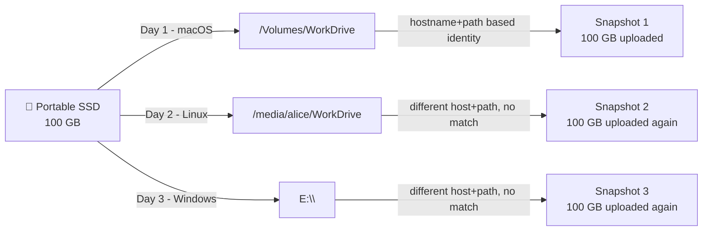
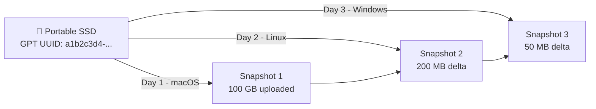
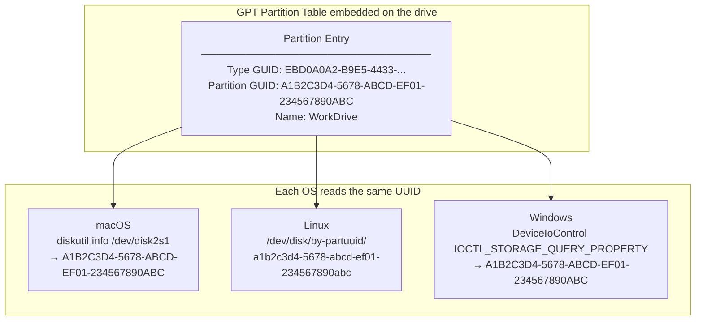
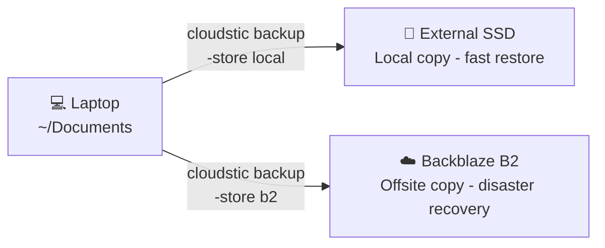

A portable drive is not a backup. It is a single point of failure in your pocket. But making a *real* backup of one turns out to be harder than it sounds, because portable drives have a property that quietly breaks most backup tools: they move between machines.

On Monday your SSD is at `/Volumes/WorkDrive` on your Mac. On Tuesday the same drive appears at `/media/alice/WorkDrive` on your Linux workstation. On Wednesday it is `E:\` on a Windows laptop.

Most backup tools use hostname and mount path as the identity of a source. Every time those change, the tool starts fresh, uploading everything again. You get no incremental history, no space savings, and a growing cloud bill.

This article breaks down how popular tools handle (and mostly mishandle) portable drive backups. Then we walk through a hands-on approach that works correctly across machines, platforms, and mount points.

## The Cross-Machine Problem

Suppose you have a 100 GB portable SSD. You want encrypted, incremental backups to a cloud bucket. Day 1: you plug it into your Mac and back it up. Day 2: you plug it into your Linux box and back it up again. You changed 200 MB of files. How much data should Day 2 upload?

With a tool that treats the two runs as the **same source**: **200 MB**.
With a tool that treats them as **different sources**: **100 GB**, from scratch.



The correct behaviour requires a stable identifier for the drive that survives remounting. That identifier already exists on every modern drive: the **GPT partition UUID**.



## How Popular Tools Handle It

### rsync / `--link-dest`

rsync is the backbone of countless backup scripts. With `--link-dest`, unchanged files are hardlinked from the previous backup directory rather than copied, giving you space-efficient snapshot rotation.

```bash
rsync -av \
  --link-dest=/backup/2026-03-11 \
  /Volumes/WorkDrive/ \
  /backup/2026-03-12/
```

`--link-dest` points to a path on your backup storage. When you switch machines, you either have no access to that path, or you have to manually find and pass in whatever directory was last used. rsync has no concept of source identity, encryption, or drive UUIDs. It is a copy tool, not a backup system.

**Portable drive verdict:** ❌ Mount point changes break incremental history. Manual scripting required for every scenario.

### Time Machine (macOS)

Apple's Time Machine tracks backups per machine. Source identity is `computername + Apple-specific volume UUID`. Two machines backing up the same drive produce two independent histories with zero deduplication between them.

Time Machine is also macOS-only, requires APFS or HFS+ on the destination, and writes to Apple's proprietary sparse bundle format. There is no CLI, no user-controlled encryption, and no cloud storage target.

**Portable drive verdict:** ❌ Per-machine only, no cross-machine incremental, macOS exclusive.

### Restic

Restic is a serious, well-regarded tool. Repositories are encrypted and content-addressed. They can target S3, B2, SFTP, and local storage. Source identity lives in the snapshot metadata as `hostname + paths`.

```bash
# Machine A (macOS)
restic -r s3:s3.amazonaws.com/my-bucket backup /Volumes/WorkDrive

# Machine B (Linux) - different hostname, different path
restic -r s3:s3.amazonaws.com/my-bucket backup /media/alice/WorkDrive
```

These two snapshots share no lineage. Restic re-uploads everything from scratch.

The workaround is `--host`:

```bash
restic -r s3:s3.amazonaws.com/my-bucket backup \
  --host "portable-ssd-identity" \
  /media/alice/WorkDrive
```

This works, but requires you to maintain that `--host` value consistently across every machine, every time. There is no auto-detection, and if you forget the flag once you get a spurious full backup. The paths still vary across OSes, so you need tags or filters to reason about snapshot history.

**Portable drive verdict:** ⚠️ Works with manual `--host` discipline. No UUID auto-detection.

### Borg Backup

Borg is an excellent deduplicating archiver with strong encryption and compression. Source identity is `hostname + paths`. It has no native cloud storage; repositories must be local or accessed over SFTP. You can override hostname with the `--override-fingerprint` flag, but there is no UUID-based tracking built in.

**Portable drive verdict:** ⚠️ Manual hostname override required. Local or SFTP repositories only.

### Tool Comparison

| Tool | Source identity | Cross-machine incremental | GPT UUID detection | Cloud storage |
|---|---|---|---|---|
| rsync `--link-dest` | Mount path | ❌ | ❌ | ❌ |
| Time Machine | Machine name + volume | ❌ | ❌ | ❌ |
| Restic | Hostname + path | ⚠️ Manual `--host` | ❌ | ✅ |
| Borg | Hostname + path | ⚠️ Manual override | ❌ | ❌ (SFTP only) |
| **Cloudstic CLI** | **GPT partition UUID** | **✅ Automatic** | **✅ Automatic** | **✅** |

## Why the GPT Partition UUID Works

Every drive formatted with a GUID Partition Table (GPT) carries a partition UUID in its metadata. This UUID is:

- **Stable** across reboots, reconnects, and cable changes
- **Consistent** across macOS, Linux, and Windows: all three OSes read the same value
- **Independent** of mount point and hostname
- **Unique** per partition, not per drive

All modern drives (USB-C SSDs, Thunderbolt enclosures, SD cards formatted as GPT, NVMe enclosures) carry this UUID. Only MBR-formatted drives (legacy FAT32 from the Windows XP era) lack it.



Cloudstic reads this UUID from the filesystem when you specify a source path that lives on a mounted partition. The UUID (not the hostname or path) is stored in the snapshot metadata and used to match future runs. Plug the same drive into a different machine, and Cloudstic finds the previous snapshot automatically.

Platform detection details:

| Platform | UUID source | Label source |
|---|---|---|
| macOS | `diskutil info` (GPT partition UUID, fallback to `getattrlist`) | `diskutil` volume name |
| Linux | `/dev/disk/by-partuuid/` (fallback to `/dev/disk/by-uuid/`) | `/dev/disk/by-label/` |
| Windows | `DeviceIoControl` GPT partition UUID | `GetVolumeInformation` |

Cross-OS compatibility by drive format:

| Drive format | macOS ↔ Linux | macOS/Linux ↔ Windows |
|---|---|---|
| GPT (exFAT, APFS, ext4, NTFS) | ✅ Automatic | ✅ Automatic |
| MBR (legacy FAT32) | Requires `-volume-uuid` flag | Requires `-volume-uuid` flag |

## Hands-On: Backing Up a Portable Drive with Cloudstic CLI

### Prerequisites

- Cloudstic CLI installed: [docs.cloudstic.com/installation](https://docs.cloudstic.com/installation)
- A GPT-formatted portable drive (the source)
- A backup store: a second drive, an S3 bucket, or a Backblaze B2 bucket

### Step 1: Format Your Drive as GPT

If you are setting up a new drive for cross-platform use, format it as GPT with exFAT (readable on all three OSes without extra drivers):

```bash
# macOS
diskutil eraseDisk ExFAT WorkDrive GPT /dev/disk2

# Confirm the partition UUID exists
diskutil info /dev/disk2s1 | grep "Partition UUID"
# → Partition UUID:              A1B2C3D4-5678-ABCD-EF01-234567890ABC
```

```bash
# Linux
sudo parted /dev/sdb mklabel gpt
sudo parted /dev/sdb mkpart primary 0% 100%
sudo mkfs.exfat /dev/sdb1

# Confirm
ls -la /dev/disk/by-partuuid/
# → a1b2c3d4-5678-abcd-ef01-234567890abc -> ../../sdb1
```

### Step 2: Initialize the Backup Repository

Create an encrypted repository. This is a one-time step.

```bash
# Using a second external drive as the store
cloudstic init \
  -store local \
  -store-path /Volumes/BackupDrive/cloudstic \
  -encryption-password "your-strong-passphrase" \
  -recovery
```

The `-recovery` flag generates a 24-word BIP39 seed phrase displayed once on screen. Write it down and store it somewhere separate from both drives and your password manager. If you ever forget the passphrase, this phrase is your only way to decrypt your backups.

To use cloud storage instead:

```bash
# Backblaze B2
export B2_KEY_ID=your-key-id
export B2_APP_KEY=your-app-key

cloudstic init \
  -store b2 \
  -store-path my-portable-backup-bucket \
  -encryption-password "your-strong-passphrase" \
  -recovery
```

### Step 3: First Backup (Machine A)

Set your environment variables to keep the commands clean:

```bash
export CLOUDSTIC_STORE=local
export CLOUDSTIC_STORE_PATH=/Volumes/BackupDrive/cloudstic
export CLOUDSTIC_ENCRYPTION_PASSWORD="your-strong-passphrase"
```

Then back up the drive:

```bash
# macOS - drive at /Volumes/WorkDrive
cloudstic backup \
  -source local \
  -source-path /Volumes/WorkDrive \
  -exclude ".Spotlight-V100/" \
  -exclude ".fseventsd/" \
  -exclude ".Trashes/" \
  -exclude ".DS_Store" \
  -tag work-drive
```

Cloudstic detects the GPT UUID from `/Volumes/WorkDrive`, records it in the snapshot, and uploads the full dataset. For a 100 GB drive with 50,000 files this is the only full upload you will ever need.

```
Scanning source...
Processing files: 50000/50000 [============================] 100%
Uploading chunks: 82341 chunks, 98.2 GiB

Backup complete.
  Files:     50000 new, 0 changed, 0 unmodified, 0 removed
  Raw data:  98.2 GiB
  Stored:    91.4 GiB (compressed + encrypted)
  Duration:  42m 18s
```

### Step 4: Incremental Backup from a Different Machine

Eject the drive, plug it into your Linux workstation. The mount path changes from `/Volumes/WorkDrive` to `/media/alice/WorkDrive`. The hostname changes. None of that matters.

```bash
# Linux - same drive, different mount path
export CLOUDSTIC_STORE=local
export CLOUDSTIC_STORE_PATH=/Volumes/BackupDrive/cloudstic
export CLOUDSTIC_ENCRYPTION_PASSWORD="your-strong-passphrase"

cloudstic backup \
  -source local \
  -source-path /media/alice/WorkDrive \
  -exclude ".Spotlight-V100/" \
  -exclude ".fseventsd/" \
  -exclude ".Trashes/" \
  -tag work-drive
```

Cloudstic reads the GPT UUID from `/media/alice/WorkDrive`, matches it to the UUID in Snapshot 1, and computes the delta.

```
Scanning source...
Processing files: 50000/50000 [============================] 100%
Uploading chunks: 14 new chunks, 186 MiB

Backup complete.
  Files:     3 new, 12 changed, 49985 unmodified, 0 removed
  Raw data:  186 MiB
  Stored:    154 MiB (compressed + encrypted)
  Duration:  8s
```

186 MB instead of 98 GB. That is the point.

### Step 5: Inspect Your Snapshot History

```bash
cloudstic list
```

```
+-----+---------------------+-----------------+------------------+-----------+------+------------+
| Seq | Created             | Snapshot Hash   | Source           | Account   | Path | Tags       |
+-----+---------------------+-----------------+------------------+-----------+------+------------+
| 1   | 2026-03-10 09:14:32 | a3f8d2e1...     | local (WorkDrive)| mac.local | /    | work-drive |
| 2   | 2026-03-12 11:42:07 | b7c4e9f3...     | local (WorkDrive)| alice-box | /    | work-drive |
+-----+---------------------+-----------------+------------------+-----------+------+------------+
```

The Account column shows different hostnames, but the same GPT UUID links both runs into one incremental chain. Path is relative to the volume mount point, so `/` means the entire drive was backed up.

### Step 6: Restore Files

Restore a directory from the latest snapshot:

```bash
cloudstic restore latest \
  -path Projects/my-project/ \
  -output ~/recovered-project.zip
```

Or restore a single file from a specific snapshot:

```bash
cloudstic restore a3f8d2e1 \
  -path Documents/contract.pdf \
  -output ~/contract-restored.zip
```

Use `cloudstic ls <snapshot-id>` to browse the file tree if you are unsure of the exact path.

### Step 7: Set a Retention Policy

Keep 7 daily snapshots and 4 weekly snapshots:

```bash
cloudstic forget \
  --keep-daily 7 \
  --keep-weekly 4 \
  --prune
```

Because Cloudstic groups snapshots by volume UUID, this policy applies across all machines that backed up this drive. You get 7 daily snapshots total, not 7 per machine. History stays clean no matter how many hosts touched the drive.

### Step 8: Automate the Backup

Add a cron job to run the backup automatically whenever the drive is plugged in, or on a schedule:

```bash
# Edit crontab
crontab -e

# Add: run every day at 9 AM
0 9 * * * CLOUDSTIC_STORE=local \
           CLOUDSTIC_STORE_PATH=/Volumes/BackupDrive/cloudstic \
           CLOUDSTIC_ENCRYPTION_PASSWORD="your-passphrase" \
           cloudstic backup \
             -source local \
             -source-path /Volumes/WorkDrive \
             -exclude ".Spotlight-V100/" \
             -exclude ".fseventsd/" \
             -exclude ".Trashes/" \
             -quiet
```

The backup will silently skip if the drive is not mounted (the source path will not exist), so cron-scheduling is safe even when the drive is not always connected.

## Handling Legacy MBR Drives

If you have an older FAT32 drive formatted with MBR, there is no GPT partition UUID. Use the `-volume-uuid` flag to assign one manually:

```bash
cloudstic backup \
  -source local \
  -source-path /Volumes/OldDrive \
  -volume-uuid "AAAABBBB-CCCC-DDDD-EEEE-FFFFFFFFFFFF"
```

Choose any UUID-shaped string and use it consistently on every machine. Store this value alongside your encryption password in your password manager. If you ever want a fresh lineage (say you reformatted the drive), just change the UUID.

The cleaner long-term path is to convert the drive to GPT. This wipes all data, so copy everything off first.

## Using a Portable Drive as the Backup Store

Everything above treats the portable drive as the **source** (the thing you are protecting). You can just as easily use a second portable drive as the **backup store** (the destination that holds your encrypted repository).

```bash
# Init a repo on the backup drive
cloudstic init \
  -store local \
  -store-path /Volumes/BackupDrive/cloudstic \
  -encryption-password "your-passphrase"

# Back up your laptop to it
cloudstic backup \
  -source local \
  -source-path ~/Documents \
  -store local \
  -store-path /Volumes/BackupDrive/cloudstic
```

This satisfies the local copy leg of the 3-2-1 rule (3 copies, 2 different media, 1 offsite). A portable store gives you physical control and fast restore speeds. But you still need an offsite copy; a cloud backend covers that:



Run both backup commands. Same repository format, same encryption key, two independent stores.

## Pre-Flight Checklist

A backup you have never restored is not a backup. It is a promise.

1. **Format as GPT**: verify UUID is present before the first backup.
2. **Save the recovery key**: store the 24-word phrase separately from both drives.
3. **Dry run first**: `cloudstic backup ... -dry-run` to confirm your exclude patterns.
4. **Verify after first run**: `cloudstic check` re-reads and hashes all objects.
5. **Test a restore**: pick one directory, restore it, open a few files.
6. **Automate**: cron on macOS/Linux, Task Scheduler on Windows.
7. **Monitor disk space**: `df -h /Volumes/BackupDrive` before each scheduled run.
8. **Prune regularly**: `cloudstic forget --keep-daily 14 --keep-weekly 8 --prune` keeps the repository from growing unbounded.
